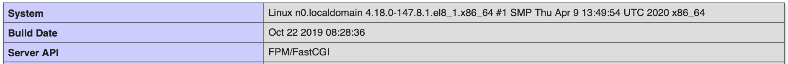

# Development web server with load balancer

Build a NGINX + Apache httpd web server serving PHP application with a Varnish
or HAProxy load balancer in front of it following the diagram below:


## Requirements

1. Publish your source code to a Git repository. Use configuration management
   tool of your choice to install all required software onto a VM (Ansible,
   Chef, Bash, etc.).

   The whole environment should be brough up only by running a single command:

   ```bash
   vagrant up
   ```

2. Install PHP and create PHP application at `/var/www/html/index.php` with the
   following code:

   ```php
   <?php phpinfo();?>
   ```

3. Varnish or HAProxy should listen on port `:80` and serve 2 web server
   backends: `127.0.0.1:81` and `127.0.0.1:82`.

4. Install and configure NGINX to listen on port `:81` and serve
   `/var/www/html/index.php` application.

5. Install and configure Apache httpd to listen on port `:82` and serve
   `/var/www/html/index.php` application.

6. The [http://192.168.100.101](http://192.168.100.101) URL being opened from
   your host machine sholud show load-balanced web application similar to the
   shown on a picture below:

   

   You should be able to differentiate which specific backend (NGINX or Apache
   httpd) has served your request.

7. Operating system should be CentOS or Ubuntu.

8. Please, use Vagrant and VirtualBox for virtualization.

9. Add brief documentation to your solution.

10. Estimated time is up to 4 hours.
